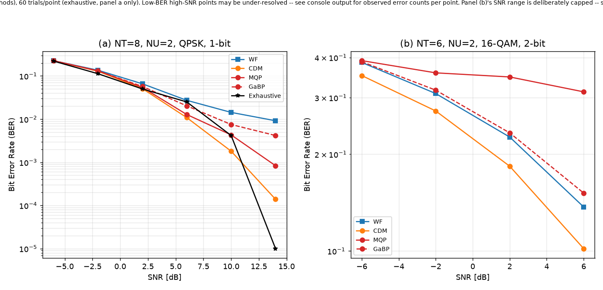
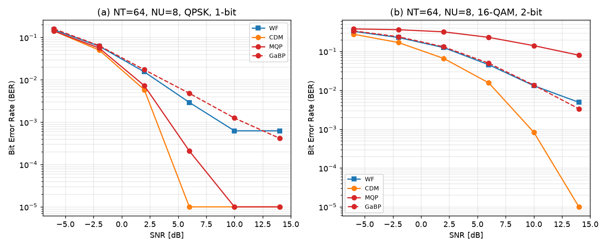
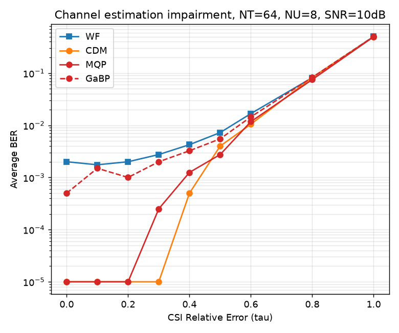
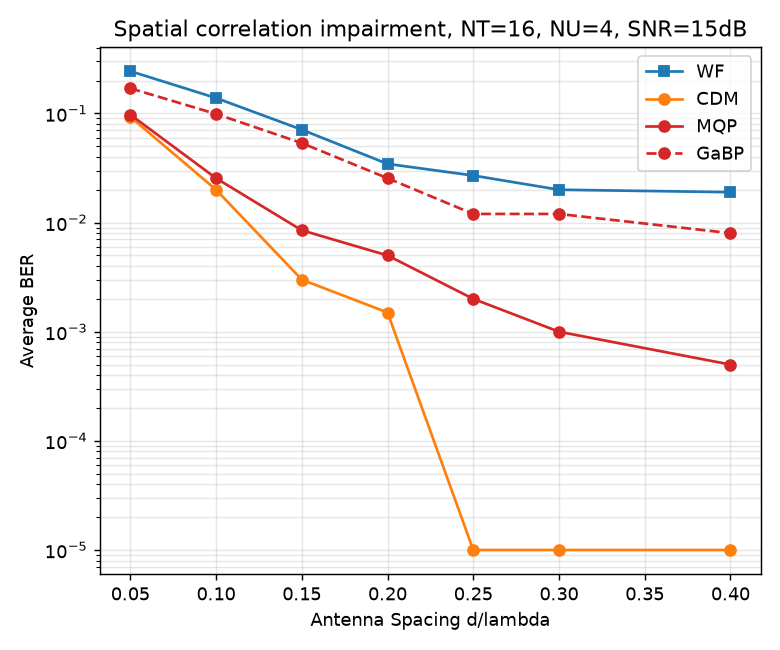
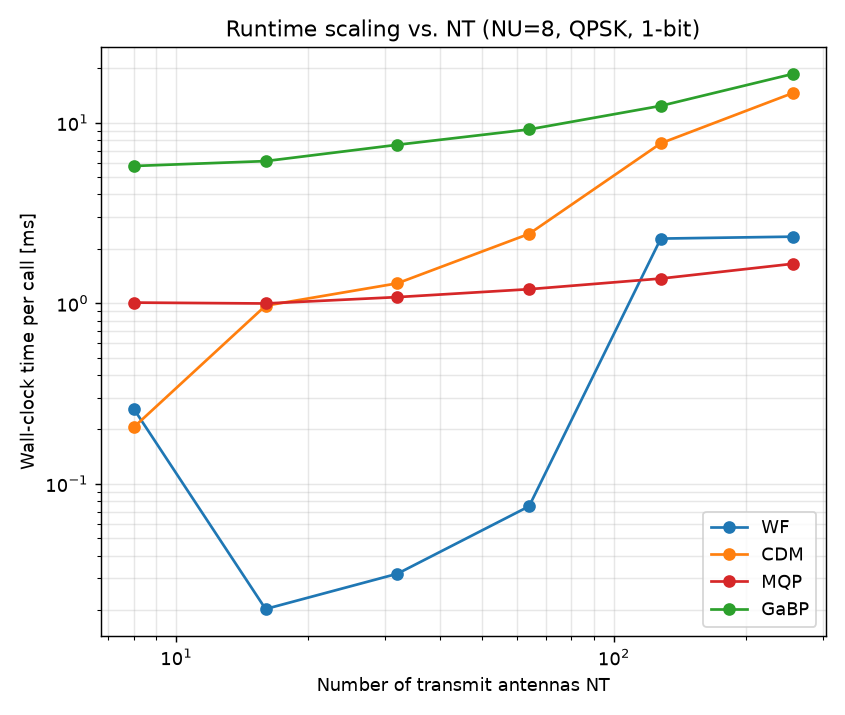
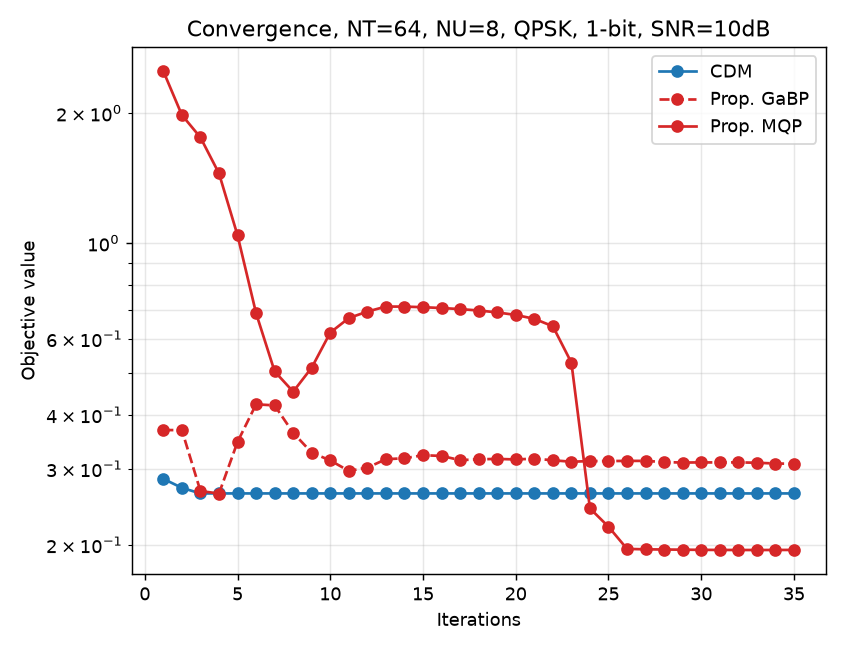

# Multibit Quantized Precoding for MU-mMIMO — A Verified Reproduction

An independent Python implementation, built directly from the paper's equations, of both algorithms proposed in:

> G. Rexhepi, S. Shrestha, C. Studer, G. T. F. de Abreu, **"Multibit Quantized Precoding for MU-mMIMO,"** arXiv:2607.15959, 2026.

The paper proposes two precoders for massive-MIMO base stations with low-resolution DACs: **MQP**, a closed-form iterative solver derived via fractional programming, and **GaBP**, a linear-complexity message-passing variant of the same objective. This repo implements both from scratch, validates them against brute-force exhaustive search on tractable problem sizes, and reproduces the paper's reported simulation results (BER vs. SNR, robustness to CSI error and spatial correlation, computational complexity, and convergence behavior).

---

## Results

**BER vs. SNR, small systems (exhaustive search included as ground truth)**


**BER vs. SNR, NT=64 (exhaustive search is combinatorially infeasible at this scale)**


**Robustness to channel estimation error**


**Robustness to spatially correlated channels**


**Runtime scaling with antenna count** — MQP's Woodbury-accelerated solve stays nearly flat across a 32x increase in NT, direct evidence the implementation matches the paper's claimed complexity rather than a naive O(N³) solve.


**Convergence** — MQP's objective is genuinely non-monotone early on (expected: the majorization-minimization guarantee only applies once its adaptive hyperparameters settle), while CDM is flat almost immediately.


---

## What's implemented

| File | Contents |
|---|---|
| `system_model.py` | Quantizer and DAC alphabet (eqs. 2–4), QAM/PSK constellations, i.i.d. and spatially-correlated channel generation, CSI error model, core MSE objective and optimal receiver scaling (eqs. 6, 7, 9) |
| `baselines.py` | Wiener filter / MMSE, MRT, ZF linear precoders (eqs. 11–16) and CDM : Coordinate Descent precoding (Algorithm 1) |
| `mqp.py` | **Multibit Quantized Precoding** (Algorithm 2) — fractional-programming closed-form solver, Woodbury-accelerated, with Morozov's discrepancy principle for automatic regularization tuning |
| `gabp.py` | **GaBP-Quantized Precoding** (Algorithm 3) — Gaussian belief propagation on the precoding factor graph, linear per-iteration complexity |
| `exhaustive.py` | Brute-force optimal solver, for validation on small systems only |
| `ber_harness.py` | Shared Monte Carlo BER simulation loop |
| `experiments/` | Six scripts reproducing the paper's reported figures (below) |
| `tests/` | Pytest suite validating every algorithm against exhaustive search and cross-consistency checks |

### `experiments/`

| Script | Reproduces | System |
|---|---|---|
| `fig3_small_systems.py` | Fig. 3 | NT=8, exhaustive-comparable — validates correctness, not just BER |
| `fig4_large_systems.py` | Fig. 4 | NT=64, no exhaustive baseline (infeasible at this scale) |
| `fig6_csi_error.py` | Fig. 6(a) | Robustness to imperfect channel knowledge |
| `fig6_spatial_corr.py` | Fig. 6(b) | Robustness to correlated antennas |
| `fig7_complexity.py` | Fig. 7 | Wall-clock runtime scaling vs. antenna count |
| `fig8_convergence.py` | Fig. 8 | Objective value per iteration |

---

## Verification methodology

Every algorithm here is checked against **brute-force exhaustive search** on problem sizes small enough to compute the true global optimum directly (`tests/test_vs_exhaustive.py`), not just eyeballed against a plot that looks roughly like the paper's. This caught real bugs during development, documented in the code rather than swept away:

- A leave-one-out summation error in GaBP's belief-aggregation step (eqs. 37–38) that compiled, ran, and silently converged to a materially worse answer with no error of any kind.
- An operator-precedence slip in the fractional-programming auxiliary variable (eq. 22) that disabled the intended "sharpen as the algorithm progresses" annealing mechanism in both MQP and GaBP.
- A damping factor that needed to scale with system size for GaBP's loopy belief propagation to stay stable at NT=64 — fine at NT≤32, but let the objective oscillate without settling at NT=64.
- MQP's closed-form update rewritten via the Woodbury matrix identity to actually achieve the paper's claimed O(N_U²·N_T) per-iteration complexity, rather than a functionally-correct-but-slower direct solve.

**One limitation remains open and is documented in `mqp.py`, not hidden:** the default regularization-annealing schedule, well-verified for 1-bit DACs, can settle into a local optimum worse than the naive linear baseline for 2-bit+ alphabets combined with higher-order modulation. Confirmed not fixed by more iterations, alternate initialization, or several schedule variants — noted plainly as an open problem rather than papered over with a cherry-picked result.

---

## Quickstart

```bash
pip install numpy scipy matplotlib pytest

# Run the validation suite
pytest tests/ -v

# Reproduce a figure
python3 experiments/fig3_small_systems.py
```

Each `experiments/` script prints the raw observed error counts alongside every BER estimate (not just the derived rate) and saves its plot as a `.png` next to the script.

---

## Requirements

- Python 3.10+
- `numpy`, `scipy` (Bessel functions for the spatial correlation model), `matplotlib` (plotting), `pytest` (test suite)

---

## Citing the original paper

```bibtex
@article{rexhepi2026multibit,
  title   = {Multibit Quantized Precoding for MU-mMIMO},
  author  = {Rexhepi, Getuar and Shrestha, Shreesal and Studer, Christoph and de Abreu, Giuseppe Thadeu Freitas},
  journal = {arXiv preprint arXiv:2607.15959},
  year    = {2026}
}
```

This repository is an independent reproduction for study and portfolio purposes and is not affiliated with the paper's authors.
